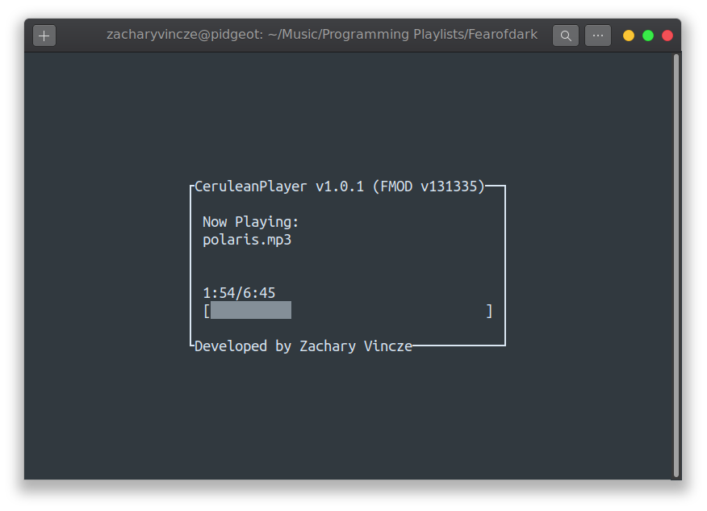

# Cerulean Player
CLI music player using FMOD and ncurses. This is more of a personal tool, but feel free to use it. :)

## Usage
    cerulean-player <directory/song/playlist>

- `Space/P`: Pauses the song
- `Right arrow`: Switches to next song
- `Left arrow`: Switches to previous song
- `R`
- `S`: Lowers song speed
- `W`: Increases song speed
- `A`: Seeks backwards
- `D`: Seeks forwards
- `,`: Quickly seeks backwards
- `.`: Quickly seeks forwards
- `Q`: Quits the player
- `-`: Lowers volume
- `=`: Increases volume

## Installation
    mkdir build && cd build && cmake .. && sudo make install